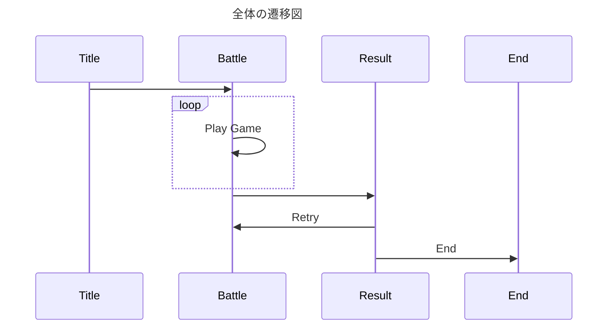

# 横スクロールシューティングゲーム（仮題）

https://kkngsm.github.io/game/

## 今後の改善点

- [ ] タイトルの追加
- [ ] リザルトの追加
- [x] プレイヤー行動範囲の制限
- [ ] 時間の追加
- [ ] スコア、スコアボードの追加
- [ ] Cookie の活用
- [ ] エフェクトの追加
- [ ] モーションブラーの追加
- [ ] ブルームの追加
- [ ] 音の追加
- [ ] 結膜の追加
- [ ] 敵モブの追加
- [ ] 敵アニメーションの追加
- [ ] ステージの追加

## クラス図

